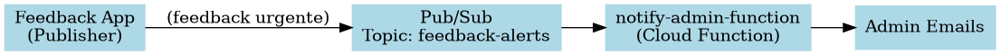

# notify-admin-function

## Descrição
A **Notify Admin Function** é uma **Cloud Function do GCP** que monitora **feedbacks urgentes de aulas** e envia alertas por email para os administradores cadastrados.

Ela é acionada automaticamente quando uma mensagem é publicada no tópico **Pub/Sub** `feedback-alerts`. A função decodifica os dados, converte avaliações textuais (`ONE`, `TWO`, etc.) para números (`1`, `2`...), aplica um template HTML e envia os emails imediatamente, garantindo que os administradores sejam notificados sobre feedbacks urgentes.

## Fluxo da Função



---

## Stack / Tecnologias Usadas
- **Linguagem:** Java 17
- **Frameworks:** Google Cloud Functions Framework
- **Bibliotecas adicionais:**
    - Gson (JSON parsing)
    - Jakarta Mail (envio de emails)
- **Serviços GCP:**
    - Cloud Functions (execução da função)
    - Pub/Sub (trigger de mensagens)
    - IAM / Service Accounts (permissões)
    - Cloud Logging (logs de execução)

---

## Pré-requisitos
- Conta GCP ativa e projeto configurado (`fiap-adj8-feedback-platform`)
- Google Cloud SDK (`gcloud`) instalado e autenticado
- Java JDK 17 instalado
- Maven 3+ para build da aplicação

---

## Deploy / Instalação
1. Tornar o script de deploy executável:
```bash
chmod +x deploy.sh
```

2. Executar o deploy:

```bash
./deploy.sh
```

O script realiza automaticamente:

- Criação do tópico Pub/Sub feedback-alerts (se não existir)

- Criação/atualização da função Cloud Function notify-admin

- Configuração da Service Account sa-deploy-notify-admin

- Envio de uma mensagem de teste para validação da função

## Como Executar / Testar

A função é acionada automaticamente por mensagens publicadas no Pub/Sub feedback-alerts.

### Testando manualmente:

```bash
gcloud pubsub topics publish feedback-alerts \
  --message '{
    "studentName":"Test Student",
    "lessonName":"Test Lesson",
    "comment":"Test feedback",
    "rating":"FIVE",
    "date":"2025-11-26T10:00:00"
}'
```

Ver logs da função:

```bash
gcloud functions logs read notify-admin --region us-central1 --limit 50
```

## Permissões Necessárias

### Service Account de Deploy: sa-deploy-notify-admin

- roles/cloudfunctions.developer

- roles/pubsub.admin

- roles/logging.viewer

- roles/storage.admin

### Service Account de Runtime: sa-runtime-notify-admin

- roles/pubsub.subscriber

- roles/logging.logWriter

Essas permissões permitem que a função execute corretamente, leia mensagens do Pub/Sub, envie emails e registre logs.

## Estrutura de Arquivos

```text
notify-admin-function/
├── src
│   └── main
│       └── java
│           └── fiap_adj8/feedback_platform
│               ├── application
│               │   └── port
│               │       └── out
│               │           ├── client
│               │           │   └── AdminServiceClientPort.java
│               │           ├── email
│               │           │   ├── EmailSender.java
│               │           │   └── input
│               │           │       └── EmailInput.java
│               │           └── template
│               │               └── TemplateProvider.java
│               ├── domain
│               │   └── model
│               │       ├── AlertMessageDetails.java
│               │       └── PubSubMessage.java
│               └── infra
│                   └── adapter
│                       ├── in
│                       │   └── NotifyAdminFunction.java
│                       └── out
│                           ├── client
│                           │   └── AdminServiceClientAdapter.java
│                           ├── email
│                           │   └── JakartaMailSender.java
│                           └── template
│                               └── TemplateLoader.java
├── pom.xml
├── deploy.sh
├── notify_admin.dot
├── notify_admin.png
└── README.md
```

## Exemplo de Mensagem Pub/Sub
```json
{
  "studentName": "John Doe",
  "lessonName": "Kubernetes Basics",
  "comment": "Great class!",
  "rating": "FIVE",
  "date": "2025-11-26T10:00:00"
}
```
